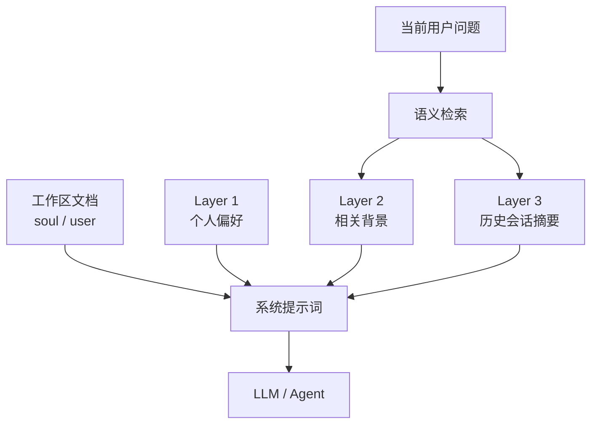

> Nomi 系列第二篇。整体设计见[《从回答问题到完成工作：Nomi 的 Agent 实践》](/posts/2026-09-04-nomi-ai-workspace/)，这篇细说上下文。

对一个工作型 AI 来说，"记忆"很容易被误解成保存全部聊天记录。

但保存得更多，并不代表理解得更好。历史越长，噪声越多；每次都把整段对话交给模型，成本和干扰也会随之增加。所以 Nomi 用的不是"全量历史回灌"，而是把上下文拆成工作区文档、分层记忆和会话摘要，每轮请求按不同规则组合。

## 上下文不是一个仓库，是几样职责不同的东西

Nomi 在普通聊天和 Agent 聊天里都会构建系统提示词，内容包括：

- 当前日期与北京时间
- 工作区中的 `soul` 与 `user` 两份文档
- 产品及工具的使用规则
- 根据当前问题检索出的记忆
- Agent 对话中还会加上可用文件和工具调用历史

这里重要的不是"来源多"，而是不同来源承担不同职责。工作区文档是用户显式维护的长期上下文；记忆则分三层——Layer 1 个人偏好、Layer 2 情境记忆、Layer 3 会话摘要。这样模型既能拿到稳定背景，又不必每次都背着全部历史。

## 第一层：始终可见的个人偏好

Layer 1 里的活跃记忆会作为"个人偏好"直接注入每次对话。

这一层适合放相对稳定、跨任务有效的内容，比如用户希望被怎么称呼，或者长期偏好的表达方式。称呼这件事还专门做了处理：从这一层识别昵称，并在系统提示词里要求模型逐字符使用——否则模型很容易自作主张把称呼改掉。

## 第二层：只在相关时出现的情境记忆

Layer 2 的记忆不会全部注入。系统先对当前问题生成 embedding，再和已有记忆算余弦相似度，只有达到阈值的才进候选集，最终最多取五条；排序除了相关性，还参考访问次数和时间衰减形成的热度。

也就是说，这一层不只是问"这条记忆在不在"，还在问：

> 它和这次任务有关吗？
> 它是否仍然值得被优先使用？

某个项目的历史决策不该干扰一次无关的翻译请求；但当用户再聊起那个项目时，它又应该被自动找回来。这一层的意义就在这——让背景信息按相关性出现，而不是永久占着上下文。

## 第三层：让会话留下结论，而不是全部过程

会话记录本身在数据库里，但跨会话复用的不是原文，是摘要。

用户切换或新建会话时，前端会异步请求服务端为当前会话生成摘要。摘要由模型压成一到三句，重点保留关键决策和具体结论，随后也会生成 embedding 供后续语义检索。每轮对话里最多选两条相关摘要注入上下文。

这解决的是一个很实际的问题：完整历史适合回看，但不适合无限累积到模型上下文里。摘要保留的是"当时得出了什么结论"，而不是"当时聊了哪些细节"。

## 记忆不能只增不减

如果记忆只进不出，最终还是会回到上下文过载。所以还有一套压缩机制：

- 相似度高的片段会被聚类，由模型合并成更短的新记忆
- 长期未访问、热度很低的内容会被归档
- 手动写入或被频繁访问的 Layer 2 内容受保护，不优先参与压缩

目标不是"记得越多越好"，而是维持一套能长期用下去的上下文资产。这也是它和简单聊天归档的区别：前者会检索、排序、压缩、归档，后者只是不断堆。

## 工作区：用户自己说了算的那部分

除了自动沉淀的记忆，还有工作区文档。`soul` 与 `user` 两类内容会被读取并合进系统提示词。它们不是模型猜出来的，而是用户可以直接管理的上下文来源。

记忆系统解决的是"系统从历史里找回什么"，工作区解决的是"用户希望系统始终遵循什么"。两者合起来，分工是清楚的：

- 工作区文档：用户主动定义的长期规则与身份背景
- Layer 1：稳定的个人偏好
- Layer 2：与当前问题相关的情境事实
- Layer 3：跨会话可复用的历史结论

## 准确地记住，恰当地遗忘

Nomi 的上下文设计不试图让模型记住用户说过的每一句话。

它做的是几件更具体的事：把稳定偏好留下来，把相关背景按需找回，把历史过程压成结论，让过期和低价值的信息逐步退出活跃上下文。

对工作型 AI 来说，真正重要的不是记忆容量，而是当前这一刻，模型手里的信息够不够、准不准。

**记忆的价值不在于保存过去，而在于让下一次工作更少从零开始。**
