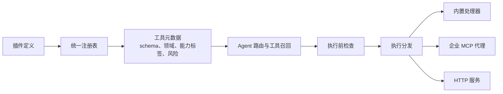
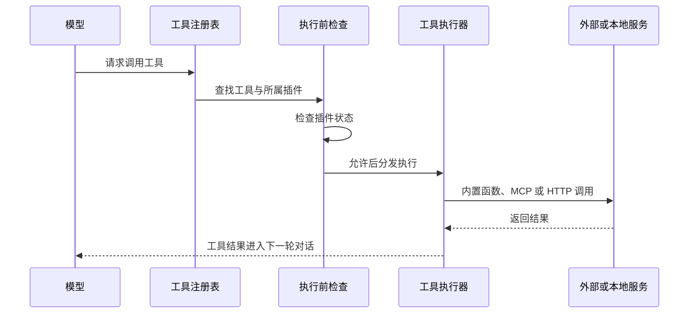

> Nomi 系列第三篇。整体设计见[《从回答问题到完成工作：Nomi 的 Agent 实践》](/posts/2026-09-04-nomi-ai-workspace/)，这篇细说插件化。

Nomi 的 Agent 不把"搜索、写笔记、发消息、读 Excel、创建待办"直接写进聊天逻辑，而是把这些能力组织成插件。

这不是单纯的代码拆分。插件在这里是连接三件事的边界：

1. 模型能看到什么工具
2. 某个工具如何执行
3. 某个工具在什么条件下可以执行

所以插件化让 Nomi 的能力不只是可增加，更是可管理。

## 一个插件不只是"一个功能"

每个插件导出同一种 `PluginDefinition` 结构，至少包含两部分：

- 面向产品界面的插件信息：名称、描述、图标、版本、可用状态
- 面向 Agent 的工具定义：工具名称、参数 schema、执行方式、能力标签、适用领域、风险等级

以工作区插件为例，它不会只说"我能管理工作区"，而是明确拆成读取文档、更新基础配置、读取模板、创建模板、读写文件、删除文件等具体工具。

这种细化很关键。"工作区"是产品概念，而模型真正需要调用的是确定、可校验、可审计的操作。

## 让模型看见工具，但不让模型决定一切

插件里的工具 schema 会被转成模型可调用的 function tool。模型知道工具名称、用途和参数，却不直接接触数据库、文件系统或企业接口。

模型提出调用之后，才进入执行链路：

这套结构把"模型的选择权"和"系统的执行权"分开了。模型判断任务需要什么能力，系统判断该能力是否存在、是否开启、如何安全执行。模型不会因为生成了一段工具调用文本，就获得任意系统权限。

## 内置能力与用户开启能力分层

注册表把插件分成两类：

- 内置插件：工作区、定时任务、Office 文件能力
- 业务插件：知识库搜索、记事本、Web 搜索、生图、日程、工单、云盘、公司内部聊天工具、办公能力、待办等

内置插件不出现在插件市场里，在 Agent 中按需加载。业务插件单独维护，由用户在插件管理界面自主开启。

这样分层避开了两个极端：把所有能力永远暴露给模型，工具集会膨胀；要求用户每次任务前手动配置所有底层能力，又太重。工作区、任务和办公文件属于平台型基础能力；其余能力则由用户决定要不要纳入自己的工作范围。

## 没开启的插件，也要让模型知道

这里有个容易被忽略的细节：**用户没开启的插件，不是从模型视野里彻底消失，而是照样告诉模型"有这么个东西，但当前不可用"。**

区别在用户体验上很明显。如果直接把未开启的工具藏起来，用户问"帮我查下这周的日程"，模型只能说"我做不到"——这句话是错的，系统明明有日程能力，只是没开。而现在模型知道这个能力存在、只是未启用，就可以直接说清楚：这个功能需要你先在插件管理里开启日程插件，开完再问我一次。

一个是死路，一个是下一步该做什么。差别只在于要不要把"不可用"和"不存在"分开表达。

当然，未开启的工具不会进入模型真正可调用的集合——它只是被记录下来，作为解释的依据，而不是执行的入口。

## 插件元数据同时服务于路由、安全与体验

工具定义里有三类特别重要的元数据。

第一类是 `capabilities`，比如 `workspace.read`、`note.write`、`scheduler.create`，用来把意图识别的结果映射到候选工具。

第二类是 `domains`。每个工具可以属于 `general`、`workspace`、`office` 中的一个或多个领域。Agent 识别出任务领域之后，优先召回当前领域内的相关工具，而不是把全部插件交给模型。

第三类是 `riskLevel`，分四档：

- `read`：读取
- `write`：写入
- `external_send`：向外部系统发送
- `destructive`：删除或不可逆操作

这些字段不只是用来展示的。运行时里，读取工具直接执行；写入工具默认进入确认流程；外发与删除始终需要确认。

所以一个插件的定义，同时决定了它如何被模型理解、如何被路由，以及如何被安全地执行。

## 统一执行器，让接入方式不影响 Agent

目前支持三种执行方式：

- `builtin`：服务端内置处理器执行，适合本地数据库、工作区、文件与任务操作
- `mcp_proxy`：通过企业 MCP 代理调用内部服务
- `http`：调用普通 HTTP 服务

对模型来说这三种没有区别，它只看到统一的工具名称与参数 schema。

好处是可以在不动 Agent 主循环的前提下，把不同来源的能力接进同一条任务流。知识库、云盘、内部聊天、工单和本地待办的底层实现完全不同，却遵循同一套调用、返回和轨迹记录方式。

## 插件化带来的直接收益

- **扩展成本更低**：新增能力主要是写一个插件定义并加入注册表
- **工具集更可控**：Agent 可按用户开关、任务领域和意图筛选工具
- **执行边界更清晰**：模型、执行器和外部服务之间职责分离
- **风险策略可复用**：确认逻辑由统一的风险等级驱动，而不是每个功能各自处理

这套体系也还在长。工具定义里已经有 `requiresAuth` 字段，但通用的用户工具授权校验还没做完——元数据先把授权的表达能力预留出来了，统一校验还欠着。

## 插件化不是功能货架，而是能力治理

如果只是把功能罗列在插件市场里，插件化就只是一种界面组织方式。

但在 Nomi 里，插件还承担了工具注册、能力召回、用户开关、执行分发和风险控制。它实际上是在为 AI 建一层能力治理。

模型可以越来越聪明，但企业场景真正需要的是：它知道该用什么能力、什么时候可以用，以及用完之后由谁承担结果。
