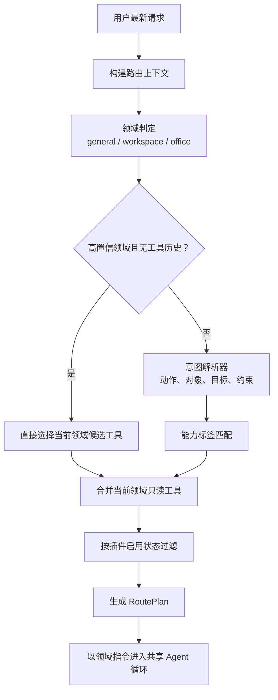

> Nomi 系列第四篇。整体设计见[《从回答问题到完成工作：Nomi 的 Agent 实践》](/posts/2026-09-04-nomi-ai-workspace/)，这篇细说工具路由。

当 AI 只能对话时，系统只需要把用户问题交给模型。

但 Nomi 的 Agent 可以调用搜索、笔记、工作区、定时任务、Office 文件、日程、工单、云盘和消息等工具。工具一多，问题就变成：

> 模型在每一轮任务中，应该看到哪些工具？

现在的做法不是把全部工具一次性交出去，而是在进入执行循环前先走一条路由链：构建任务上下文，判定领域，解析意图，召回候选工具，最后按插件状态筛选。

## 工具多了，模型并不会自然变得更可靠

把所有工具都暴露给模型，看起来最省事：模型总能"看到"全部能力。但它带来三个直接问题。

工具描述会占用更多上下文。模型不仅要理解用户问题，还要在一堆无关工具之间做选择。

选错的概率会上升。用户只是想读一条笔记，模型却可能去搜索、去创建文件，或者调用其他相邻能力。

权限和开关会变得难以解释。用户没开启的插件、当前任务不需要的工具，不应该成为模型的候选动作。

所以"给模型哪些工具"被当成一个独立的编排问题，而不是 LLM 调用时的固定配置。

## 第一步：为路由保留有限但足够的上下文

路由不是只看最后一句话。

系统会收集最近五轮用户消息；如果最新请求里出现"刚才""上面""之前""继续""同样"这类指代词，窗口就扩到七轮。同时扫描完整消息历史，把最近一次工具结果的前 300 个字符附上。

这样下面这种请求才有机会被正确理解：

> 按照刚才的结果整理一下。

"刚才"在这里不只是一个代词，它会触发更长的上下文窗口，最近的工具结果也会进入路由输入。路由因此能判断任务是不是在延续上一步，而不是只看孤立的一句话。

## 第二步：先判断任务属于哪个领域

Agent 分三个领域：

- `general`：通用问答、搜索、图片生成和基础任务编排
- `workspace`：工作区、记事本、模板和定时任务
- `office`：Word、Excel、报表、导出、上传文件、日程、工单和消息

领域判断用关键词打分，不再多花一次大模型调用。Office 与 Workspace 各有一组关键词，每命中一个加分，最高不超过 1；`general` 始终保留 0.2 作为兜底。两者同分时优先 Office。

重点不是分类做得多复杂，而是先用低成本、可解释的规则把范围缩小。

每次路由还会把各领域的得分、命中的关键词和次级领域写进 `RoutePlan`。这意味着事后可以追查："为什么这次任务被判成了办公任务。"

## 第三步：用意图把自然语言映射为能力

不够高置信的情况，会调一次意图解析器，要求模型输出结构化 JSON：用户要执行的动作、操作对象、目标、上下文引用、时间或其他约束、置信度。

目前支持的动作包括内部检索、联网搜索、查询日程、查询工单、读取笔记、创建文档、创建笔记、创建提醒、上传文件、发送消息、生成或编辑图片、直接回答和总结。

这些动作不直接绑定某一个工具，而是先映射为能力标签。"创建提醒"会映射到 `scheduler.write`、`task.create`、`todo.create`；"查询日程"会映射到 `calendar.query`、`meeting.query`、`schedule.read`。随后从插件注册表里找出声明了这些标签的工具。

这层抽象避开了"意图识别结果必须等于工具名"。同一种意图可以对应多个工具，工具本身也可以随插件演进而替换。

## 第四步：补充领域内的只读能力

意图解析不总能覆盖用户真正需要的全部信息。

所以按意图召回之后，还会补上当前主领域的只读工具。办公领域里，读取类文档或日程能力可以作为补充候选；工作区领域里，读取笔记、模板或工作区内容可以自然进入候选集。

这是一种"意图优先、领域兜底"的策略：意图决定任务最可能需要什么，领域只补低风险的读取能力；写入、外发这类高影响操作不会仅仅因为属于某个领域就自动加进来。

实现上虽然记录了次级领域，但候选工具的默认补充仍然围绕主领域。这是有意让召回范围收敛，而不是把多个领域的全部能力混着交给模型。

## 第五步：筛掉不可用工具，再进入执行循环

候选工具不等于最终可用工具。

系统会按插件启用状态过滤：需要用户显式开启、但还没启用的插件工具会被记进 `blockedTools`，不进入模型可调用的集合——但也不会被完全丢弃，模型仍然知道它们存在，可以据此建议用户去开启。最终可用工具、被阻止工具和风险动作会一起写进 `RoutePlan`。

之后才根据主领域加载对应的领域指令，进入 Agent 循环。

有一点值得说明：General、Workspace 和 Office Agent 不是三个独立的后端服务，它们共享同一个执行循环，区别来自各自的领域指令与工具集合。这是个务实的选择——先复用同一条稳定执行链，再用领域提示词和工具边界形成行为分工。

## 内置能力也不是全部预加载

工作区、定时任务和本地 Office 文件能力还有一层按需加载：模型先调用一个轻量的路由工具，声明需要哪个内置插件，系统把它加入当前任务的已加载集合，下一轮再把具体工具加进模型的工具列表。

上传 Word 或 Excel 是个特例。系统在构建会话上下文时发现有可用文件，会直接热加载 Office 能力，不等模型发起路由。

两种策略对应两种情形：用户意图明确时，由模型按需加载；文件已经在会话里时，由系统提前备好。

## 路由的本质是为模型减负

这套路由不试图替模型完成推理。

它做的是先消除明显不相关的选择：把多轮上下文收拢成路由输入，把任务归入一个主领域，把自然语言意图映射成能力标签，把没开启的插件排除在可调用集合之外，再让模型在更小的操作空间里行动。

收益是直接的——更少无关工具进入上下文，工具选择更贴近当前任务，用户的插件开关能真实影响 Agent 行为，整个路由、召回与过滤过程可以被记录和追踪。

**好的 Agent 路由，不是替模型做决定，而是让模型只需要面对值得做的决定。**
