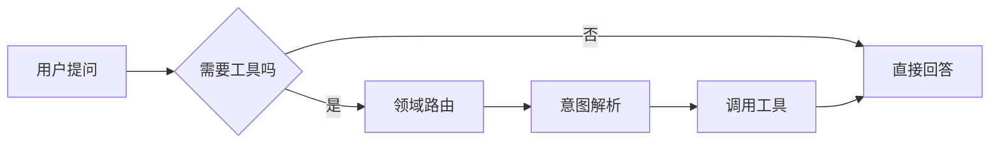
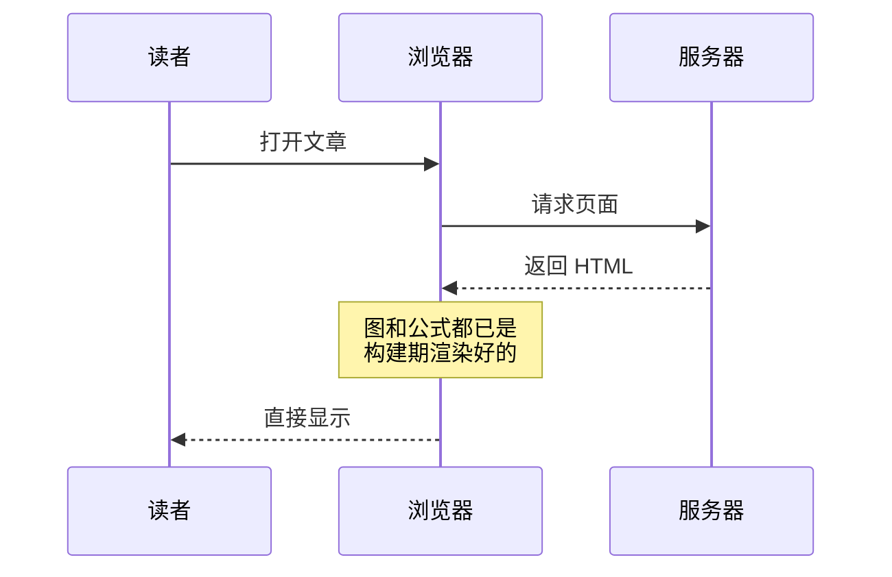
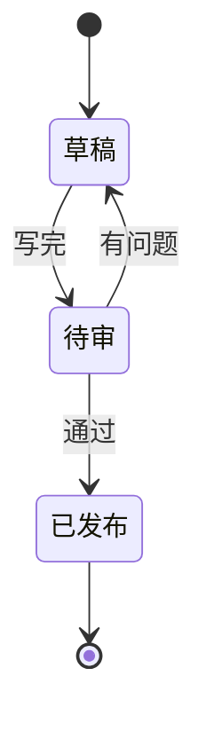

这篇是本地预览用的样例，`draft: true`，不会出现在线上。

## 行内代码不受影响

公式只认 `$$…$$` 块级，所以 shell 变量是安全的：

配置 Maven 时要写 `export PATH=$MAVEN_HOME/bin:$PATH`，
Java 则是 `export PATH=$JAVA_HOME/bin:$PATH`。

## 数学公式

归并排序的递归式与其解：

$$
T(n) = 2T\left(\frac{n}{2}\right) + O(n) \implies T(n) = O(n \log n)
$$

行内引用也可以放在块里，比如二分查找每次把区间减半：

$$
\log_2 1000000 \approx 20
$$

带希腊字母和求和：

$$
\sigma^2 = \frac{1}{N}\sum_{i=1}^{N}(x_i - \mu)^2
$$

## 流程图

## 时序图

## 状态图

